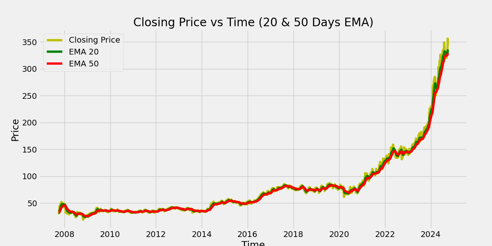
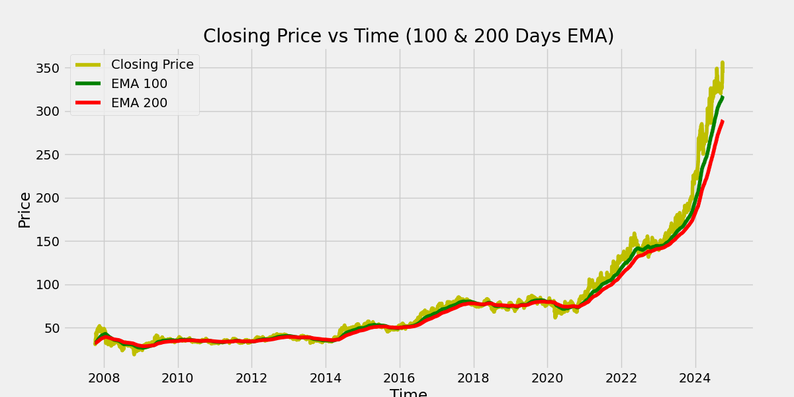
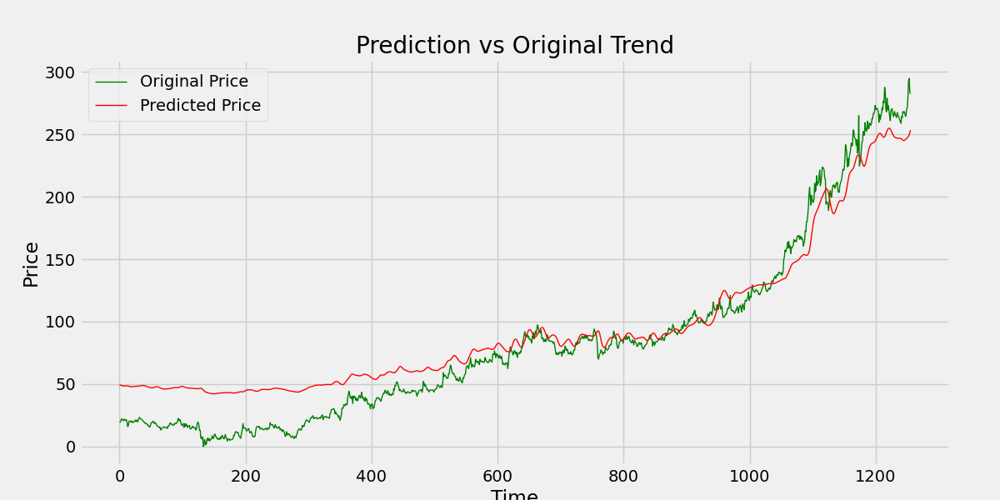

# 📈 Stock Market Trend Prediction  

This project is a **Stock Market Trend Prediction Web Application** built using **Flask, Keras, and Yahoo Finance API**.  
It allows users to enter a stock ticker (default: `POWERGRID.NS`) and view:  

- Exponential Moving Averages (EMA) trends (20/50/100/200 days)  
- Predicted stock prices vs original trend using a trained Deep Learning model  
- Descriptive statistics of stock data  
- Downloadable dataset in CSV format  

---

## 🚀 Features  

- 🔹 Fetches real-time stock data from **Yahoo Finance**  
- 🔹 Calculates **EMA (20, 50, 100, 200 days)** for trend analysis  
- 🔹 Deep Learning model predicts stock price trends  
- 🔹 Interactive charts for visualization  
- 🔹 Descriptive statistics (mean, std, min, max, etc.)  
- 🔹 Export and download dataset as CSV  

---

## 🛠️ Tech Stack  

- **Backend:** Flask, Keras (TensorFlow), Scikit-learn, NumPy, Pandas  
- **Frontend:** HTML, Bootstrap 5, Jinja2  
- **Data Source:** Yahoo Finance API (`yfinance`)  
- **Visualization:** Matplotlib  
- **Model File:** `stock_dl_model.h5` (Trained deep learning model)  

---

## 📂 Project Structure  

📁 Stock-Market-Trend-Prediction
│── app.py # Flask backend
│── templates/
│ └── index.html # Frontend template
│── powergrid.csv # Sample dataset
│── Stock Price Prediction.ipynb # Jupyter Notebook (model training/testing)
│── static/
│ │── ema_20_50.png # EMA chart (20 & 50 days)
│ │── ema_100_200.png # EMA chart (100 & 200 days)
│ │── stock_prediction.png # Prediction vs Original chart
│ │── POWERGRID.NS_dataset.csv # Exported dataset (example)
│── stock_dl_model.h5 # Pre-trained DL model (not included here)
│── requirements.txt # Python dependencies
│── README.md # Project documentation


---

## ⚙️ Installation & Setup  

1️⃣ **Clone this repository**  

```bash
git clone https://github.com/Adi1972004/Stock-Market-Trend-Prediction.git
cd Stock-Market-Trend-Prediction
2️⃣ Create a virtual environment (recommended)
python -m venv venv
source venv/bin/activate   # On Mac/Linux
venv\Scripts\activate      # On Windows
3️⃣ Install dependencies
pip install -r requirements.txt
4️⃣ Run the Flask app
python app.py
5️⃣ Open in browser
http://127.0.0.1:5000/

## 📊 How It Works  

1️⃣ **User Input** → User enters a stock ticker (e.g., `RELIANCE.NS`, `AAPL`, `TSLA`).  

2️⃣ **Data Fetching** → Application downloads stock history via **Yahoo Finance API**.  

3️⃣ **Trend Analysis** → EMAs (**20/50/100/200 days**) are calculated for trend analysis.  

4️⃣ **Prediction** → Deep Learning model (`stock_dl_model.h5`) predicts future stock price trends.  

5️⃣ **Visualization** → The app generates interactive charts:  
   - 📌 Closing Price vs EMA (20 & 50)  
   - 📌 Closing Price vs EMA (100 & 200)  
   - 📌 Predicted Price vs Original Price  

6️⃣ **Dataset Export** → The complete dataset is available to **download as CSV**.  
## 📷 Screenshots  

### 1. Closing Price with EMA 20 & 50  
  

### 2. Closing Price with EMA 100 & 200  
  

### 3. Predicted vs Original Price  
  

📑 Example Dataset

Sample exported dataset: POWERGRID.NS_dataset.csv

📌 Future Improvements

✅ Add more ML/DL models for comparison

✅ Deploy on Heroku/Render/Streamlit for public access

✅ Add live prediction for upcoming days

✅ Integrate with real-time trading APIs

👨‍💻 Author

Developed by Aditya Chandel 🚀

📌 GitHub: https://github.com/Adi1972004
